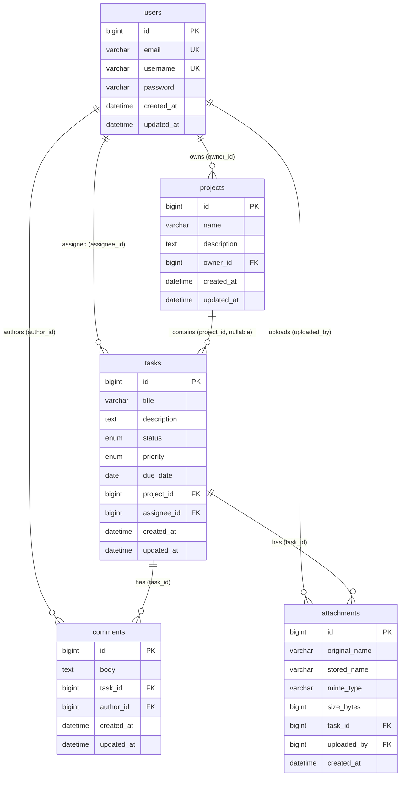

# TaskFlow — Backend

Raw Java 21 REST API with no web framework. Built on the JDK's built-in `HttpServer`, HikariCP for connection pooling, and raw JDBC `PreparedStatement` for all database access.

---

## Module structure

```
taskflow/                       ← Maven parent (pom.xml manages versions)
├── taskflow-domain/            ← POJOs + enums, zero external dependencies
├── taskflow-persistence/       ← DbConnection (HikariCP) + all *Dao classes
├── taskflow-service/           ← Business logic, Java Streams, TokenStore
├── taskflow-http/              ← Handlers, Server, AuthFilter, CorsFilter
└── taskflow-util/              ← CsvExporter, FileUploadUtil, JsonUtil
```

Dependency direction is strictly one-way: `http → service → persistence → domain`. `util` is used by `http` and `service`. No circular dependencies.

---

## Prerequisites

| Tool | Version |
|------|---------|
| Java | 21+ |
| Maven | 3.8+ |
| MySQL | 8 (Docker recommended, port 3307) |

---

## Database setup

```bash
# Start MySQL container
docker run --name taskflow-mysql \
  -e MYSQL_ROOT_PASSWORD=root \
  -e MYSQL_DATABASE=taskflow_db \
  -p 3307:3306 -d mysql:8

# Apply the schema (idempotent — safe to re-run)
mysql -h 127.0.0.1 -P 3307 -u root -proot taskflow_db \
  < ../db/migrations/V1__init.sql
```

The schema creates five tables: `users`, `projects`, `tasks`, `comments`, `attachments`.

---

## Running the server

```bash
cd taskflow

# Build all modules (skip tests for speed)
mvn clean package -q -DskipTests

# Start the server
mvn exec:java -pl taskflow-http \
  -Dexec.mainClass="com.taskflow.http.Server"
```

Server starts on **`http://localhost:8080`** and logs to stdout.

To run tests:
```bash
mvn test
```

---

## Configuration

### Database connection

The database connection is configured by `DbConnection.java` (a HikariCP pool
singleton) in the `taskflow-persistence` module. It loads
`taskflow-persistence/src/main/resources/config.properties` from the classpath
on first use; if the file is missing it fails fast with a clear
`IllegalStateException` (never an NPE).

| Property | Default (`config.properties`) | Description |
|----------|-------------------------------|-------------|
| `db.url` | `jdbc:mysql://localhost:3307/taskflow_db?useSSL=false&allowPublicKeyRetrieval=true&serverTimezone=UTC` | JDBC URL |
| `db.username` | `taskflow` | DB user |
| `db.password` | `taskflow` | DB password |
| `db.pool.maximumPoolSize` | `10` | HikariCP max pool size |
| `db.pool.connectionTimeout` | `30000` | Connection timeout (ms) |

The pool name is fixed to `TaskFlowPool`.

### Environment-variable overrides (Docker)

For the three connection credentials, environment variables take precedence over
`config.properties` when set and non-blank — this is how `docker-compose.yml`
points the app at the `db` service. The pool-size and timeout settings are read
only from `config.properties`.

| Env var | Overrides property |
|---------|--------------------|
| `DB_URL` | `db.url` |
| `DB_USERNAME` | `db.username` |
| `DB_PASSWORD` | `db.password` |

Example (matching the Compose setup):

```bash
export DB_URL="jdbc:mysql://db:3306/taskflow_db?useSSL=false&allowPublicKeyRetrieval=true&serverTimezone=UTC"
export DB_USERNAME=taskflow
export DB_PASSWORD=taskflow
```

> **Note:** local runs use MySQL on host port **3307** (`db.url` default), while
> inside Docker the app reaches MySQL on the internal port **3306** via the
> `DB_URL` override.

---

## Database schema & relationships

Five tables, defined in `db/migrations/V1__init.sql` (InnoDB, `utf8mb4`). Every
relationship is a real `FOREIGN KEY` constraint.

### Entity-relationship diagram



### Relationships

| Child table | Column | → Parent | Cardinality | Nullable | FK constraint |
|-------------|--------|----------|-------------|----------|---------------|
| `projects` | `owner_id` | `users.id` | many projects → one owner | No | `fk_projects_owner` |
| `tasks` | `project_id` | `projects.id` | many tasks → one project | **Yes** (task can be unassigned to a project) | `fk_tasks_project` |
| `tasks` | `assignee_id` | `users.id` | many tasks → one assignee | **Yes** | `fk_tasks_assignee` |
| `comments` | `task_id` | `tasks.id` | many comments → one task | No | `fk_comments_task` |
| `comments` | `author_id` | `users.id` | many comments → one author | No | `fk_comments_author` |
| `attachments` | `task_id` | `tasks.id` | many attachments → one task | No | `fk_attachments_task` |
| `attachments` | `uploaded_by` | `users.id` | many attachments → one uploader | No | `fk_attachments_uploader` |

Notes:
- No `ON DELETE CASCADE` is defined. Deleting a `project` that still has `tasks`
  is rejected at the application layer (`ProjectHasTasksException` → HTTP `409`).
- `users.email` and `users.username` are both `UNIQUE`.
- The domain field `Task.userId` maps to the `tasks.assignee_id` column.

---

## API endpoints

All routes require `Authorization: Bearer <token>` except `/auth/register` and `/auth/login`.

### Auth
| Method | Path | Body | Response |
|--------|------|------|----------|
| POST | `/auth/register` | `{ email, username, password }` | `201 { id, email, username }` |
| POST | `/auth/login` | `{ email, password }` | `200 { token }` |

### Tasks
| Method | Path | Notes |
|--------|------|-------|
| GET | `/tasks` | Optional `?status=TODO&priority=HIGH&projectId=1` |
| POST | `/tasks` | Body: `{ title, description?, status, priority, dueDate?, projectId? }` |
| PUT | `/tasks/{id}` | Full replacement body |
| DELETE | `/tasks/{id}` | `204` on success |
| GET | `/tasks/export/csv` | Streams RFC 4180 CSV |

### Projects
| Method | Path | Notes |
|--------|------|-------|
| GET | `/projects` | All projects for authenticated user |
| POST | `/projects` | `{ name, description? }` |
| PUT | `/projects/{id}` | `{ name, description? }` |
| DELETE | `/projects/{id}` | `409` if project has tasks |

### Comments
| Method | Path | Notes |
|--------|------|-------|
| GET | `/tasks/{id}/comments` | All comments on a task |
| POST | `/tasks/{id}/comments` | `{ body }` |
| DELETE | `/tasks/{taskId}/comments/{id}` | `204` on success |

### Attachments
| Method | Path | Notes |
|--------|------|-------|
| GET | `/tasks/{id}/attachments` | List metadata |
| POST | `/tasks/{id}/attachments` | `multipart/form-data`, field name `file`, max 10 MB |

### Dashboard
| Method | Path | Response |
|--------|------|----------|
| GET | `/dashboard/stats` | `{ byStatus: { TODO: n, ... }, byPriority: { LOW: n, ... } }` |

---

## Module responsibilities

### `taskflow-domain`
Pure POJOs and enums: `User`, `Task`, `Project`, `Comment`, `Attachment`, `TaskStatus`, `TaskPriority`. No dependencies. Shared by all other modules.

### `taskflow-persistence`
- `DbConnection` — HikariCP pool initialised from properties file. Throws on startup if MySQL is unreachable.
- `*Dao` classes — all SQL via `PreparedStatement`. No string concatenation. Each DAO owns one table.

### `taskflow-service`
- `TaskService`, `ProjectService`, `UserService`, `CommentService` — business logic, validation, Java Streams operations.
- `TokenStore` — `ConcurrentHashMap<String, TokenEntry>` with 24-hour TTL. Cleanup runs hourly via `ScheduledExecutorService`.
- `NotificationScheduler` — background thread, logs tasks due within 24h every hour.
- `StatsService` — aggregates task counts by status and priority.

### `taskflow-http`
- `Server` — entry point. Registers all contexts, sets thread pool, creates `uploads/` dir, installs JVM shutdown hook.
- `AuthFilter` — validates `Authorization: Bearer <token>` on every protected context.
- `CorsFilter` — adds `Access-Control-Allow-Origin: http://localhost:4200` to every response.
- `*Handler` classes — one class per entity group; parse request body, delegate to service, write JSON response.

### `taskflow-util`
- `CsvExporter` — writes tasks to a `Writer` as RFC 4180 CSV.
- `FileUploadUtil` — parses `multipart/form-data`, sanitises filenames (UUID prefix), writes to `uploads/`.
- `JsonUtil` — shared `ObjectMapper` singleton with `JavaTimeModule`.

---

## Key constraints

- **No Spring, no Hibernate, no Lombok** — raw Java 21 only
- **All SQL uses `PreparedStatement`** — no string-concatenated queries
- **Passwords hashed with BCrypt** — never stored in plain text
- **Token check-and-remove uses `computeIfPresent`** — avoids TOCTOU race on the `ConcurrentHashMap`
- **MySQL must be running before the app starts** — HikariCP fails fast on init if the DB is unreachable
- **`uploads/` created on startup** — `Server.java` calls `Files.createDirectories(Path.of("uploads"))` before any handler is registered
